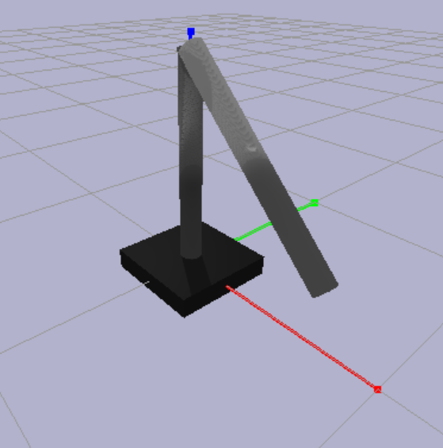

# manipulator-control
Control the Trajectory of a Robot Manipulator
## Installation Instructions

### Prerequisites

Before running this code, please make sure you have Python 3 installed on your system.

### Installing Required Packages

To install the required packages for this code, please run the following command in your terminal:
`pip install -r requirements.txt`

### Running the Code

1. Download the code from the repository.
2. Open the terminal in the directory where you have downloaded the code.
3. Run the command `python assignment1.py`.
4. The code should now run, and you should be able to see the simulation on your screen.
5. You can modify the code as per your requirements.

## PyBullet output:
The code first sets up the simulation environment by connecting to PyBullet and setting the gravity. It then loads the URDF file for the double pendulum robot and sets the initial joint angles.

Next, it initializes two PID controllers with the specified proportional, integral, derivative gains, and time step. It sets a goal position for the end effector and computes the joint angles using inverse kinematics.

The simulation is then run for 50000 steps. During each step, the current joint angles are retrieved, and the torques are computed using the PID controllers. The torques are then applied to the joints, and the simulation is stepped forward. The end effector position is checked against the goal position, and if it is within 0.1 units, the simulation is stopped.

Finally, the code disconnects from the PyBullet simulation.
goal = [1.5, 0.5, 0]

## What I learned

During my first assignment, I learned about three main topics: PID controllers, forward and inverse kinematics, and the PyBullet library.

PID controllers are a way to control the behavior of a system based on feedback. They use a mathematical formula to adjust the input to the system in response to the output. I learned about the three parts of a PID controller: proportional, integral, and derivative, and how to tune them to get the desired behavior. Additionally, I learned about time discretization and anti-windup techniques to improve the performance of the controller.

Forward and inverse kinematics are a way to calculate the position and orientation of a robot's end effector based on the joint angles. I learned how to use trigonometry and geometry to derive the equations needed for these calculations for a planar 2R robot.

PyBullet is a library that can be used to simulate the behavior of a robot in a virtual environment. I learned how to set up a simulation, load a robot model, and control its joints.

## Issues faced

While working on the assignment, I faced several issues.

The first issue was that I found it difficult to understand the theory behind PID controllers and how to apply it in practice. The mathematical formulas and concepts were new to me, and I had to spend a lot of time studying and experimenting to get a handle on them.

The second issue was that I had difficulty understanding the PyBullet library and how to use it to simulate the robot's behavior. The library had many options and settings, and I had to spend time reading documentation and experimenting with different settings to get the simulation to work as intended.

## Issues remaining to be solved

One issue that remains to be solved is the issue of the arm moving together in the simulation. This may be a result of an error in the kinematics calculations or a problem with the simulation settings, and will require further investigation to resolve. 

## Limits of the current work

The current implementation of the PID controller, kinematics, and simulation is limited in scope and functionality. It is designed for a planar 2R robot, and may not be suitable for more complex scenarios or environments. Additionally, the implementation is not fully optimized, and may require further tuning to achieve optimal performance. There may be other approaches or algorithms that could be explored to improve the implementation.
