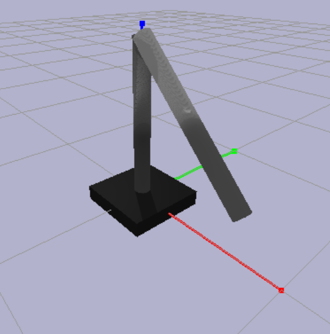

# manipulator-control
Control the Trajectory of a Robot Manipulator

## Assignment1: 2R Planar Robot Arm Simulation using PyBullet and PID Control

## Description
This script simulates a 2R planar robot arm in PyBullet and uses PID controllers to move the end effector to a desired goal position. It also includes forward and inverse kinematics functions for a 2R robot arm.

## How it works
1. The forward and inverse kinematics functions for a 2R robot arm are defined.
2. The P and PID control classes are defined.
3. The simulation environment is set up, including gravity and loading the double pendulum URDF file.
4. Initial joint angles are set for the robot arm.
5. PID gains and time step are defined, and the PID controllers for both joints are initialized.
6. The desired goal position for the end effector is set, and the corresponding joint angles are computed using inverse kinematics for the 2R arm.
7. The simulation loop runs, where the current joint angles are obtained, and torques are calculated using the PID controllers. These torques are then applied to the joints, and the simulation is stepped.
8. The loop continues until the end effector reaches the goal position or the maximum number of iterations is reached.
9. Finally, the simulation is disconnected.

## Installation Instructions
### Prerequisites

Before running this code, please make sure you have Python 3 installed on your system.

### Installing Required Packages

To install the required packages for this code, please run the following command in your terminal:
`pip install -r requirements.txt`

### Running the Code

1. Download the code from the repository.
2. Open the terminal in the directory where you have downloaded the code.
3. Run the command `python assignment1.py`.
4. The code should now run, and you should be able to see the simulation on your screen.
5. You can modify the code as per your requirements.

  
   
  the goal position for the end effector = [1.5, 0.5, 0]

## Assignment2: Optimization-based path planner for the planar 2R robot using Crocoddyl

## Description
This script demonstrates the usage of Crocoddyl to solve an optimal control problem for a double pendulum system. The code sets up a shooting problem for the double pendulum, then solves it using the Feasible Direct Differential Dynamic Programming (FDDP) solver. The resulting motion can be plotted and displayed using Gepetto Viewer.

## How it works
1. The double pendulum model is loaded from `example_robot_data`.
2. The state and actuation models are defined for the double pendulum system.
3. Running and terminal cost models are set up, including regularization costs.
4. Integrated action models are created using the defined cost models.
5. A shooting problem is constructed using the initial state, running models, and terminal model.
6. The FDDP solver is initialized with the shooting problem.
7. Solver callbacks are set based on the user's display and plot preferences.
8. The solver is used to find the optimal solution for the double pendulum problem.
9. The motion is plotted and displayed using Gepetto Viewer (if requested).
